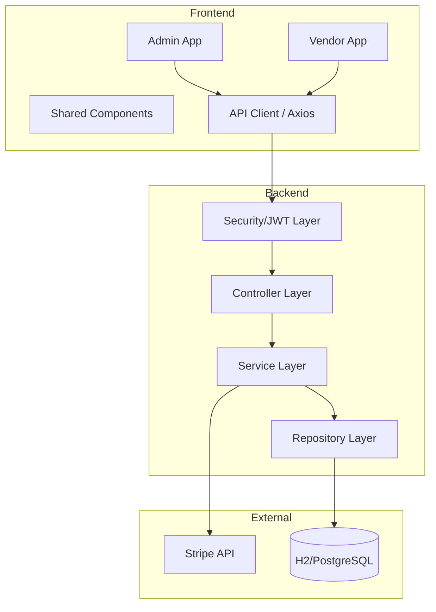

# System Architecture

## Overview
SA_PROJECT is a comprehensive stall reservation and management system for large-scale events like book fairs. It follows a modern client-server architecture with a clear separation between the backend business logic and frontend user interfaces.

## Technology Stack

### Backend
- **Language**: Java 17+
- **Framework**: Spring Boot 3.x
- **Persistence**: Spring Data JPA / Hibernate
- **Database**: H2 (Development) / PostgreSQL (Optional Production)
- **Security**: Spring Security 6.x with JWT (JSON Web Tokens)
- **Payment**: Stripe API Integration
- **Mailing**: Spring Boot Starter Mail

### Frontend
- **Framework**: React 18+
- **Build Tool**: Vite
- **Styling**: Vanilla CSS / CSS Modules
- **State Management**: React Context API & TanStack Query (React Query)
- **Routing**: React Router DOM 6+
- **Icons**: Lucide React

## Component Diagram

## Core Design Principles
1. **Layered Architecture**: Strict separation of concerns between Controllers, Services, and Repositories.
2. **DTO Pattern**: Decoupling internal entities from public API schemas using Data Transfer Objects.
3. **RBAC (Role-Based Access Control)**: Fine-grained permissions for Admins, Vendors, and Employees.
4. **Modularity**: Frontend is organized into discrete "Apps" (Admin, Vendor) sharing common core components and logic.
