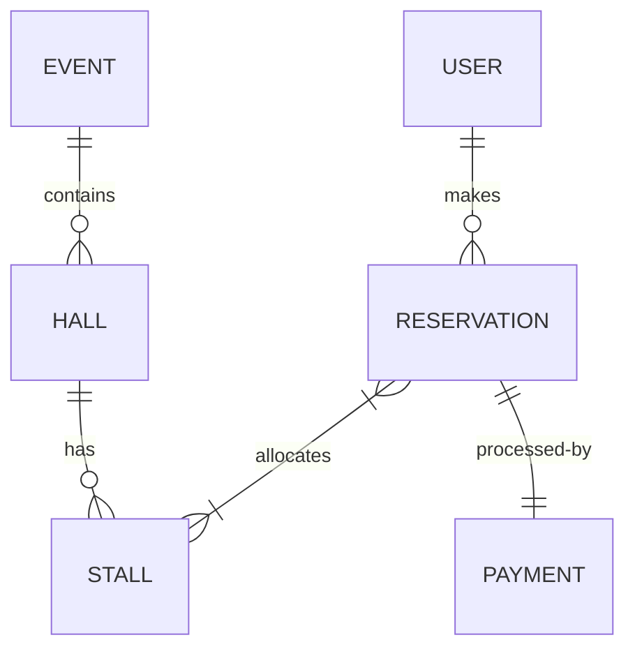

# Database Schema & Data Modeling

## Overview
The system uses a relational model managed via **JPA (Java Persistence API)** and **Hibernate**. All entities are located in the `com.bookfair.entity` package.

## Core Entities

### 1. Event
Represents a specific instance of a book fair (e.g., "Colombo Bookfair 2026").
- **Attributes**: `id`, `name`, `startDate`, `endDate`, `location`, `status` (DRAFT, OPEN, CLOSED).

### 2. Hall
A physical section within the event venue.
- **Attributes**: `id`, `name`, `code`, `capacity`.
- **Relationship**: Belongs to an `Event`.

### 3. Stall
The smallest unit of reservation.
- **Attributes**: `id`, `code`, `x`, `y` (for map coordinates), `status` (AVAILABLE, RESERVED, OCCUPIED).
- **Pricing**: Stalls use **cents** for price values to ensure precision (`priceCents`).

### 4. Reservation
Links one or more stalls to a vendor for a specific event.
- **States**: `PENDING_PAYMENT`, `PAID`, `CANCELLED`, `CHECKED_IN`, `PENDING_REFUND`.
- **TTL**: Reservations in `PENDING_PAYMENT` are automatically expired by the system if not paid within the configured timeout.

### 5. User
System actors including Admins, Vendors, and Employees.
- **Security**: Contains `roles` for RBAC implementation.

## Schema Diagram (Conceptual)

## Implementation Details

### 1. Currency Handling
**CRITICAL**: Currency is stored as `Long` in **cents** units across the entire system.
- Database field: `price_cents`.
- Reason: Avoids the rounding errors inherent in floating-point types (`Double`, `Float`) when performing financial calculations.

### 2. Auditing
The system tracks important changes through an `AuditLog` table, capturing `action`, `entityType`, `entityId`, and the `actorId` for every sensitive operation (e.g., stall deletion, refund approval).

### 3. Automatic Created/Updated Timestamps
Most entities use JPA auditing or Hibernate annotations to automatically manage `createdAt` and `updatedAt` timestamps.
