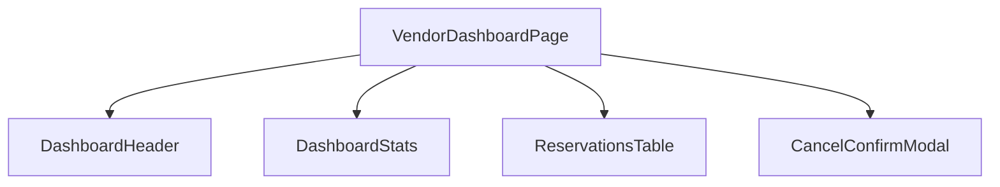

# Frontend Architecture: Apps & Shared Core

## Overview
The frontend is built with **React** and **TypeScript**, organized using a "Multi-App" or "Modular" structure. This design separates domain-specific logic (Admin vs. Vendor) while consolidating shared code in a central core.

## Directory Structure

### 1. `src/apps/`
Contains the top-level application modules. 
- **[vendor/](file:///c:/Users/User/SA_PROJECT/frontend/src/apps/vendor)**: The Vendor Portal (Booking, Profile, Tickets).
- **[admin/](file:///c:/Users/User/SA_PROJECT/frontend/src/apps/admin)**: The Administrative Console (Event management, Layout designer).

Each app contains its own `pages/` and `components/` directories, ensuring that domain-specific UI doesn't clutter the rest of the project.

### 2. `src/shared/`
The "brain" and shared library of the frontend.
- **[api/](file:///c:/Users/User/SA_PROJECT/frontend/src/shared/api)**: Centralized Axios clients and request definitions for all backend modules.
- **[components/](file:///c:/Users/User/SA_PROJECT/frontend/src/shared/components)**: Reusable UI primitives (Buttons, Modals, Stall Tooltips).
- **[context/](file:///c:/Users/User/SA_PROJECT/frontend/src/shared/context)**: Global state providers like `AuthContext`.
- **[types/](file:///c:/Users/User/SA_PROJECT/frontend/src/shared/types)**: Unified TypeScript interfaces generated from the backend DTOs.
- **[utils/](file:///c:/Users/User/SA_PROJECT/frontend/src/shared/utils)**: Formatting, validation, and math helpers.

## Modular Component Design
Recently, the project has undergone a major refactoring to modularize large page components. Instead of monolithic files, pages are now composed of small, focused sub-components.

**Example: `VendorDashboardPage` composition:**

## Routing Strategy
The system uses `react-router-dom` with a centralized route definition (typically in `App.tsx`). Routes are often protected by a `ProtectedRoute` component that verifies the user's role and authentication status from the `AuthContext` before allowing access.

## Styling
- **CSS**: The project uses vanilla CSS with modern features (CSS Variables, Flexbox/Grid).
- **Animations**: `animate.css` classes and Tailwind-like utility classes are used for entrance/exit animations and micro-interactions.
