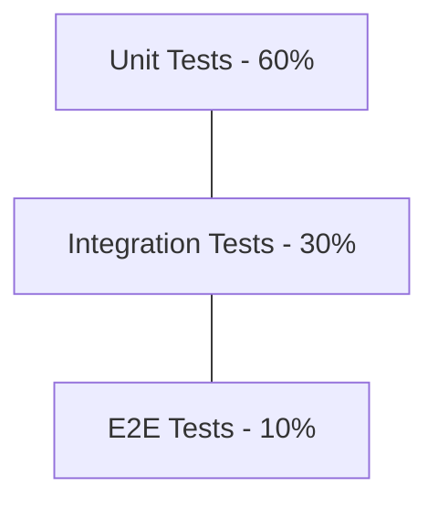

# Test Plan & Quality Assurance Strategy

## Overview
This document outlines the testing strategy for the SA_PROJECT to ensure system reliability, data integrity, and a seamless user experience. Currently, the project is in the development phase with a focus on feature implementation; this plan serves as a roadmap for establishing a robust automated testing suite.

## Testing Pyramid
The project promotes a balanced testing pyramid to maximize coverage while maintaining developer velocity.

## 1. Backend Testing (Spring Boot)

### Technologies
- **Framework**: JUnit 5, AssertJ
- **Mocking**: Mockito
- **Integration**: `@SpringBootTest` with H2 database.
- **REST Testing**: MockMvc

### Priorities
- **Service Layer**: 100% logic coverage for `ReservationService` (Stall allocation, expiry, pricing math).
- **Security Layer**: Verifying role-based access to admin endpoints and JWT validation.
- **Concurrency**: Testing for race conditions when two users attempt to book the same stall simultaneously.

## 2. Frontend Testing (React)

### Technologies (Recommended)
- **Unit/Component**: Vitest + React Testing Library.
- **E2E**: Playwright (for cross-browser validation of the Stall Map).
- **Static**: ESLint + TypeScript strict mode.

### Priorities
- **Stall Selection Logic**: Verifying that the UI correctly handles multi-stall selection and pricing updates.
- **Auth Flow**: Ensuring the `AuthContext` correctly persists tokens and redirects unauthorized users.
- **Responsive Layout**: Verifying the Admin Console and Vendor Dashboard across mobile, tablet, and desktop viewports.

## 3. Critical Test Scenarios

### A. Reservation Lifecycle
1. **Scenario**: User creates a reservation.
2. **Verification**: Stalls are marked `RESERVED`, a TTL timer starts, and a payment intent is created.
3. **Outcome**: If unpaid after 15 mins, stalls must revert to `AVAILABLE`.

### B. Admin Stall Management
1. **Scenario**: Admin deletes a hall that has active reservations.
2. **Verification**: System must prevent deletion or initiate a coordinated refund flow.
3. **Outcome**: Data integrity is maintained; no orphaned reservations.

### C. Financial Integrity
1. **Scenario**: Payment confirmation via Stripe webhook.
2. **Verification**: Reservation status updates to `PAID`, vendor notified, and QR code generated.
3. **Outcome**: Exact match between Stripe amount and database `price_cents`.

## 4. Manual Verification Flow
Until automated E2E tests are fully implemented, follow this checklist for major releases:
- [ ] **Sanity**: User can register, login, and logout.
- [ ] **Happy Path**: Vendor can select stalls, pay via Stripe, and view their ticket.
- [ ] **Admin**: Admin can create a new event and edit the layout.
- [ ] **Stripe**: Verify that payments appear in the Stripe Dashboard with the correct metadata.

---
*Last Updated: 2026-02-20*
